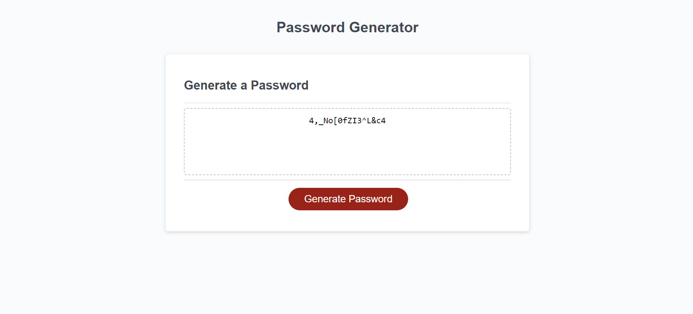

# Password Generator

## Description

This password generator site is made using JavaScript and allows to select between four different options for password. It can either include upper, lower case letters , numbers and symbols , or you can choose mix of different options. The prompt also gives user an option to select number of characters to be included in the password, from 8 to 128. After answering all of the prompts password is displayed in the text field.

 The site uses basic principles of responsive desing to make webpage more responsive and user-friendly on most device sizes.

## Installation

N/A

## Usage

Open 'index.html' in any browser, or follow this Git Pages link: [Password Generator](https://aldu1n.github.io/password-generator/). Click "Generate" buttom and follow the prompts.

## Screenshot

## Credits

N/A

## License

N/A